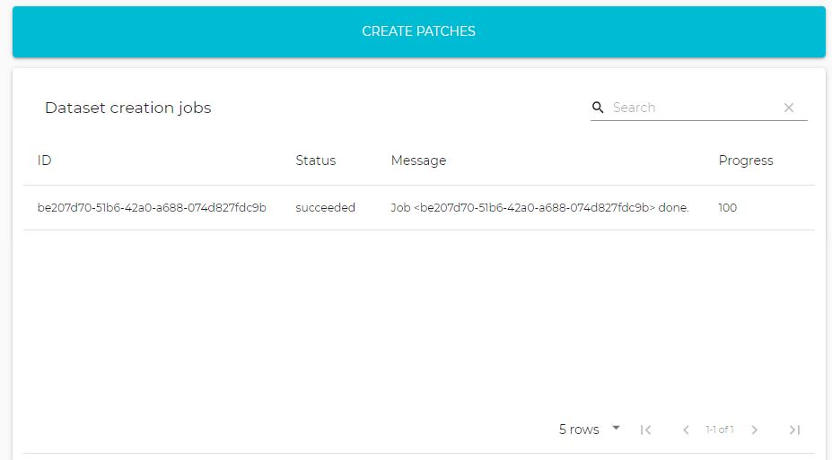

  

    Table of contents
  

  {: .text-delta }
1. TOC
{:toc}

## Welcome to GeoImageNet Project

**What**: GeoImageNet is a unique collaborative initiative involving remote sensing researchers, developers of digital research platforms, artificial intelligence experts and professionals dedicated to derive value from satellite imagery.

**How**: By facilitating the creation and download of annotations on Pleiades (50 cm) images. The imagery used to build this database includes more than 10,000 km2 of Pleiades images covering Canada's major cities as well as various other natural and anthropogenic environments (forests, wetlands, mining sites, agricultural areas, etc.). These annotations are based on a taxonomy containing many objects (approx. 180) and land cover types (approx. 50).

**Why**: To promote deep learning research on Earth Observation (EO) data for detection, segmentation and other automated tasks. This will allow researchers from diverse institutions to collaborate in a more structured and effective manner for the application of deep learning in remote sensing and to develop new value-added products based on VHR satellite images. This synergy will facilitate making more progress in research, both in remote sensing applications and in the development of machine learning algorithms.

## Creating and Managing Annotations {#annotations}

### Taxonomy Browser {#taxonomy}
The taxonomy browser shows one or two taxonomies as a tree. By clicking on each class you can access any subclasses. Next to each class name is indicated information about the current annotations (the numbers include all the class children). The circled numbers have different meanings depending on the status of the annotations:
- Blank: new annotations
- In light green: annotations released
- Dark green: annotations validated
- Red: annotations rejected
- Black: annotations erased

The following icons trigger different actions for the corresponding class (and its children):
-  view the annotations for the corresponding class
-  select this class (and subclasses) to appear in the workspace
-  send the new annotations for validation

### Workspace
The workspace shows all the annotations for the classes slected in the taxonomy browser.

Several modes are available:
- Navigation mode: the user can click on the thumbnails and quickly navigate to the corresponding location
- Editing mode: the user can edit new annotations only, the vector will appear in blue and a circle will appear along the shape
- Delete mode: the user can delete new annotations by clicking on the shape, a confirmation dalog will then appear.
- Release mode: new annotations will be released for validation
- Validation mode: new annotations that have been released can be validated.

### Datasets {#datasets}
The dataset section allows the user to donwload annotations and training data.

{: width="450px"}

In front of each dataset, you can click on Donwload.

The second panel is for administrators only in order to create new datasets.
{: width="450px"}

## Managing Models

### Packaging
In order to submit a new model to the platform, the steps are the following:
1. The model must be trained using PyTorch and the parameters saved as a .pth 
2. Add the model code to the [model repository](https://github.com/sfoucher/gin-model-repo) (by creating a fork of the repo)
3. The trained model must be packaged using the [thelper](https://github.com/plstcharles/thelper) framework.

Two notebooks are available showing how to package a [ResNet](https://github.com/crim-ca/geoimagenet/blob/master/classif_model_packaging.ipynb)  and a [UNet](https://github.com/crim-ca/geoimagenet/blob/master/seg_model_packaging.ipynb).

### Pushing Models

{: width="450px"}

## API {#api}

This documentation explains how to use the Machine Learning API from the  platform. The API is composed of two parts:
1. Access to the annotations and the taxonomies: https://geoimagenet.ca/api/v1/redoc
2. A ML API (restricted to registered users only): https://geoimagenet.ca/ml/api#

## Notebooks
A few notebbooks are demonstrating the basic use cases of the platform. They can be executed with Google Colab.
* Packaging of a patch classification model: [classif_model_packaging](https://github.com/crim-ca/geoimagenet/blob/master/classif_model_packaging.ipynb) 
* Packaging of a SegNet model: [seg_model_packaging](https://github.com/crim-ca/geoimagenet/blob/master/seg_model_packaging.ipynb) 
* Use of the annotations: coming soon...

## How to Use the Annotations for Model Training {#header1}
Coming soon...

### Support or Contact

Having trouble with Pages? Check out our [documentation](https://docs.github.com/categories/github-pages-basics/) or [contact support](https://github.com/contact) and we’ll help you sort it out.
